# End-to-End Grafana Observability Lab

A hands-on observability project built to understand how **metrics,
logs, traces, correlation, dashboards, and alerting** work together for
application monitoring and troubleshooting.

The lab uses a containerized **Spring Boot application with PostgreSQL**
and implements an observability stack using:

-   Prometheus
-   Grafana
-   Grafana Loki
-   Grafana Alloy
-   OpenTelemetry
-   OpenTelemetry Collector
-   Grafana Tempo
-   Micrometer
-   Docker & Docker Compose

The project was built incrementally across seven phases, starting with a
simple application and progressing toward an end-to-end observability
platform.

------------------------------------------------------------------------

## Project Goal

The goal of this project is to understand the complete observability
workflow rather than only creating monitoring dashboards.

The final platform can:

-   Monitor application availability and health
-   Monitor RED metrics
-   Monitor JVM metrics
-   Centralize application logs
-   Query logs using LogQL
-   Trace individual application requests
-   Investigate slow and failed requests
-   Correlate Loki logs with Tempo traces using Trace IDs
-   Detect application problems using Grafana Alerting

------------------------------------------------------------------------

### Architecture 

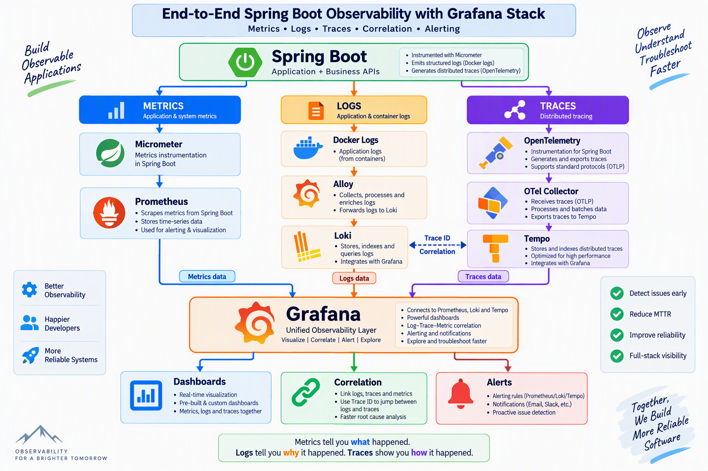

------------------------------------------------------------------------

## Technology Stack

  Technology                 Purpose
  -------------------------- ----------------------------------------------------
  Spring Boot                Demo application
  PostgreSQL                 Application database
  Docker                     Containerization
  Docker Compose             Multi-container environment
  Micrometer                 Application metrics instrumentation
  Spring Boot Actuator       Exposes application metrics
  Prometheus                 Metrics collection and storage
  PromQL                     Metrics querying
  Grafana                    Dashboards, exploration, correlation, and alerting
  Grafana Alloy              Docker log collection
  Loki                       Centralized log aggregation
  LogQL                      Log querying
  OpenTelemetry Java Agent   Automatic application tracing
  OpenTelemetry Collector    Receives, processes, and exports traces
  Tempo                      Distributed tracing backend

------------------------------------------------------------------------

## Repository Structure

``` text
grafana-observability-lab/
|
+-- demo/
|   +-- src/
|   +-- pom.xml
|   +-- Dockerfile
|
+-- prometheus/
|   +-- prometheus.yml
|
+-- loki/
|   +-- loki-config.yml
|
+-- alloy/
|   +-- config.alloy
|
+-- tempo/
|   +-- tempo.yml
|
+-- otel-collector/
|   +-- otel-collector.yml
|
+-- grafana/
|   +-- provisioning/
|   +-- dashboards/
|
+-- docs/
|   +-- phase-01.md
|   +-- phase-02-prometheus.md
|   +-- phase-03-grafana.md
|   +-- phase-04-loki-alloy.md
|   +-- phase-05-tracing.md
|   +-- phase-06-telemetry-correlation.md
|   +-- phase-07-alerting.md
|
+-- screenshots/
|   +-- architecture/
|   +-- phase-01/
|   +-- phase-02/
|   +-- phase-03/
|   +-- phase-04/
|   +-- phase-05/
|   +-- phase-06/
|   +-- phase-07/
|
+-- docker-compose.yml
+-- README.md
```

------------------------------------------------------------------------

# Phase 1 - Application Foundation

## Spring Boot + PostgreSQL + Docker

The first phase created the application that generates telemetry
throughout the project.

``` text
User
 |
 v
Spring Boot
 |
 v
PostgreSQL
```

The application runs inside Docker alongside PostgreSQL.

The following endpoints were created specifically for observability
testing:

  Endpoint        Purpose
  --------------- --------------------------------------
  `/api/health`   Generate normal successful requests
  `/api/slow`     Introduce intentional latency
  `/api/error`    Generate intentional HTTP 500 errors

These endpoints provide a controlled way to generate healthy traffic,
failures, and latency.

### Key Learning

-   Docker containerization
-   Docker Compose
-   Container networking
-   Docker DNS/service discovery
-   Environment variables
-   PostgreSQL
-   Persistent volumes
-   Health checks
-   Spring Boot Actuator
-   Failure and latency simulation

### Springboot Application Status
`#springboot` `#docker` `#containers` `#status`

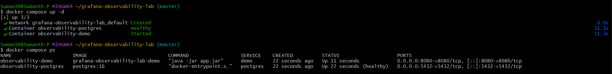

### Application Startup
`#startup` `#initialization` `#logs` `#startup-sequence`

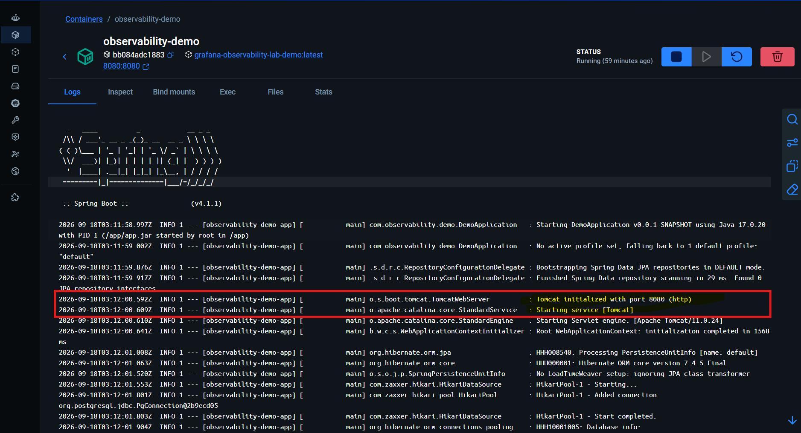


------------------------------------------------------------------------

# Phase 2 - Metrics Collection

## Micrometer + Prometheus

The Spring Boot application was instrumented using **Micrometer** and
Spring Boot Actuator.

Prometheus-compatible metrics are exposed through:

``` text
/actuator/prometheus
```

Prometheus periodically scrapes this endpoint.

``` text
Spring Boot
     |
     v
Micrometer
     |
     v
Actuator
     |
     | /actuator/prometheus
     v
Prometheus
```

Metrics monitored include:

-   HTTP request count and rate
-   HTTP errors
-   Request duration
-   JVM heap memory
-   CPU utilization
-   JVM threads
-   Garbage collection
-   Application availability

## RED Metrics

This phase introduced the RED monitoring method:

``` text
R = Rate
E = Errors
D = Duration
```

Example PromQL:

``` promql
sum(
  rate(
    http_server_requests_seconds_count{
      job="spring-boot-demo"
    }[5m]
  )
)
```

### Key Learning

-   Micrometer
-   Spring Boot metrics
-   Prometheus architecture
-   Pull-based monitoring
-   Prometheus scraping
-   PromQL
-   Time-series metrics
-   RED methodology
-   JVM monitoring


> Prometheus Targets page showing `spring-boot-demo` in the `UP` state.

### Prometheus Setup
`#prometheus` `#configuration` `#setup` `#metrics`

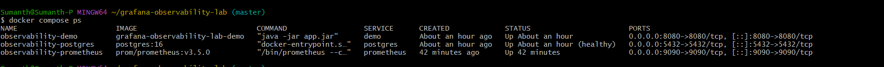

### Target Health Status
`#prometheus` `#targets` `#status` `#monitoring`

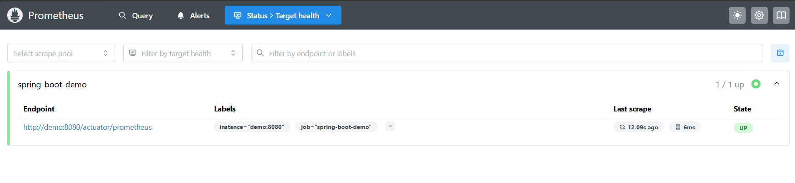

### Scraping Information
`#prometheus` `#scraping` `#metrics` `#collection`

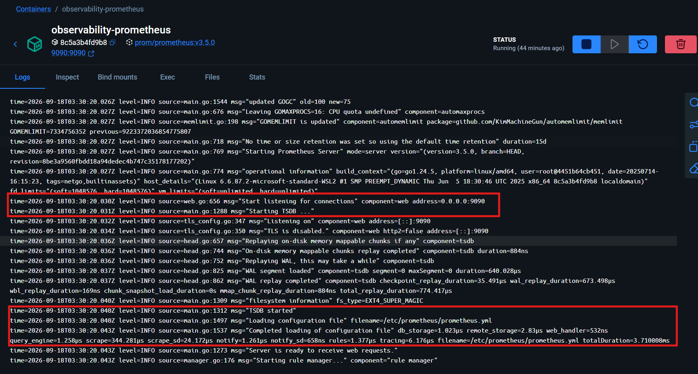

------------------------------------------------------------------------

# Phase 3 - Grafana Application Dashboard

## Grafana + Prometheus + PromQL

Grafana was introduced as the visualization layer.

``` text
Spring Boot
     |
     v
Prometheus
     |
     | PromQL
     v
Grafana
```

A custom application observability dashboard was created to monitor:

-   Application availability
-   HTTP request rate
-   HTTP 5xx error rate
-   HTTP error percentage
-   Average response time
-   JVM heap usage
-   JVM heap utilization
-   Java process CPU
-   JVM live threads
-   JVM garbage collection

The dashboard combines application RED metrics with JVM resource
metrics.

``` text
Application Monitoring
        |
        +---- Rate
        +---- Errors
        +---- Duration

JVM Monitoring
        |
        +---- CPU
        +---- Memory
        +---- Threads
        +---- GC
```

### Key Learning

-   Grafana dashboards
-   Prometheus datasource integration
-   PromQL visualization
-   RED dashboards
-   JVM dashboards
-   Application monitoring
-   Metrics troubleshooting

### Service Level Observability
`#grafana` `#dashboard` `#red-metrics` `#monitoring`

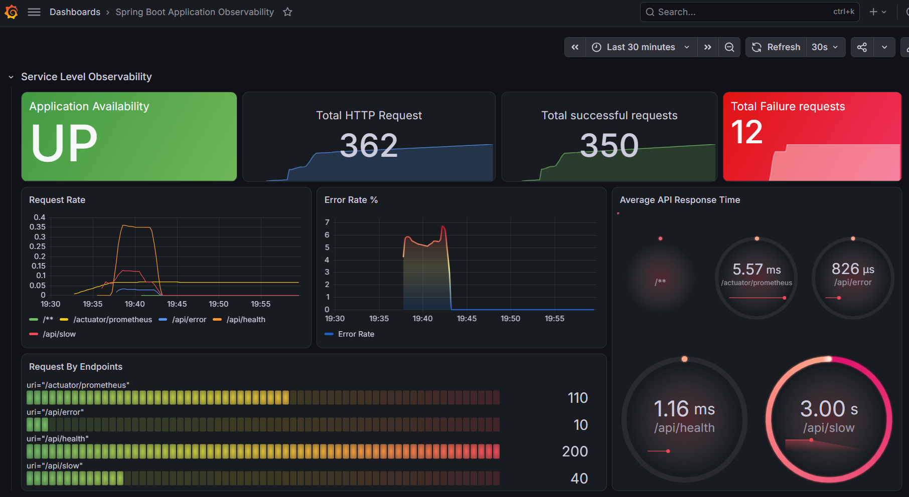

### JVM Metrics
`#grafana` `#jvm` `#memory` `#monitoring` `#performance`

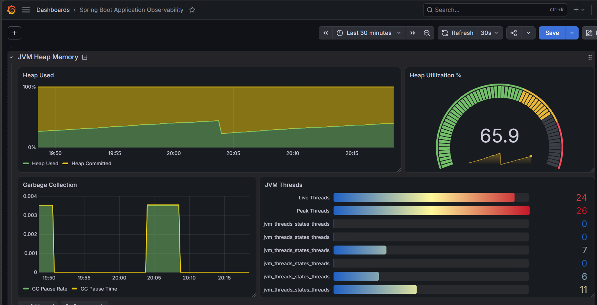

### CPU & Disk Utilization
`#grafana` `#cpu` `#disk` `#resource-metrics` `#performance`

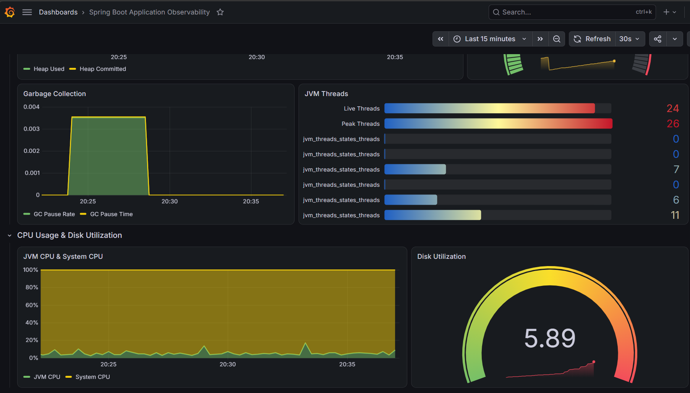

### Application Slow Response
`#grafana` `#latency` `#slow-request` `#performance-issue` `#simulation`

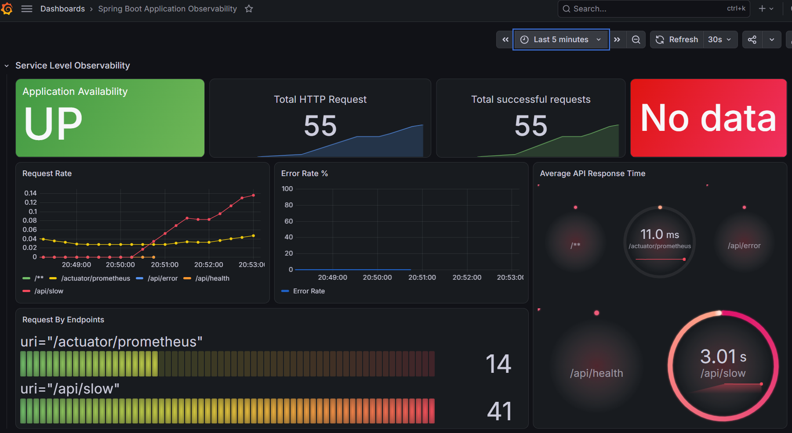

### Application Down Alert
`#grafana` `#alert` `#incident` `#application-down` `#failure`

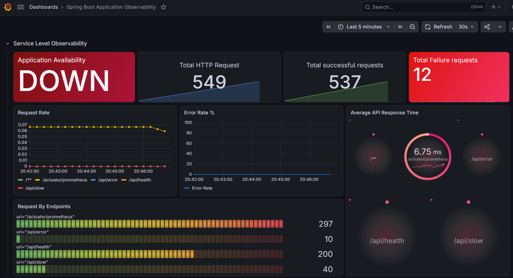

------------------------------------------------------------------------

# Phase 4 - Centralized Logging

## Grafana Alloy + Loki

Metrics identify abnormal behavior, while logs provide additional
diagnostic context.

The centralized logging pipeline is:

``` text
Spring Boot
     |
     v
Docker Logs
     |
     v
Grafana Alloy
     |
     v
Loki
     |
     v
Grafana
```

Grafana Alloy discovers Docker containers, reads their logs, and
forwards the logs to Loki.

Logs are queried using **LogQL**.

Example:

``` logql
{container="observability-demo"} |= "ERROR"
```

This enables centralized application-log investigation rather than
relying only on local `docker logs`.

A basic metrics-to-logs investigation becomes:

``` text
5xx Metric Spike
      |
      v
Prometheus
      |
      v
Grafana
      |
      v
Loki
      |
      v
Application ERROR
```

### Key Learning

-   Centralized logging
-   Grafana Alloy
-   Docker log discovery
-   Loki
-   LogQL
-   Loki labels
-   Log filtering
-   Error-log analysis
-   Metrics-to-logs investigation


> Grafana Explore with Loki selected and an `ERROR` LogQL query
> returning Spring Boot logs.

### Loki Datasource Configuration
`#loki` `#grafana` `#datasource` `#configuration`

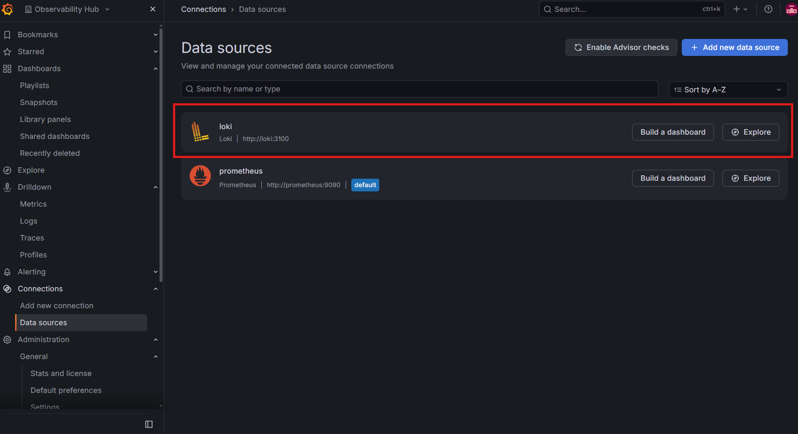

### Alloy Running Graph
`#alloy` `#monitoring` `#visualization` `#health`

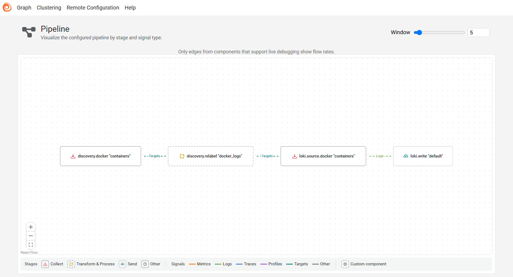

### Alloy Running Components
`#alloy` `#components` `#status` `#log-collection`

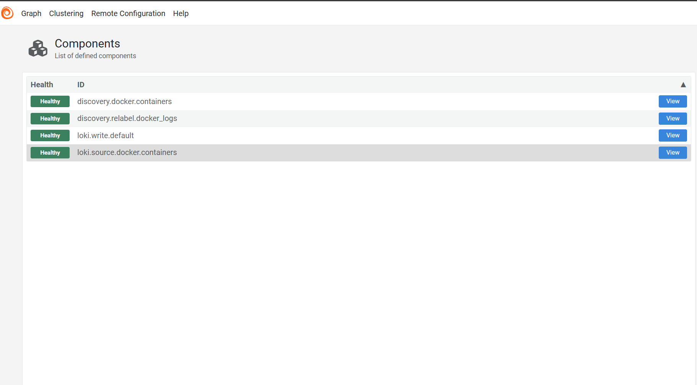

### Spring Boot Application Logs
`#logs` `#loki` `#application` `#centralized-logging`

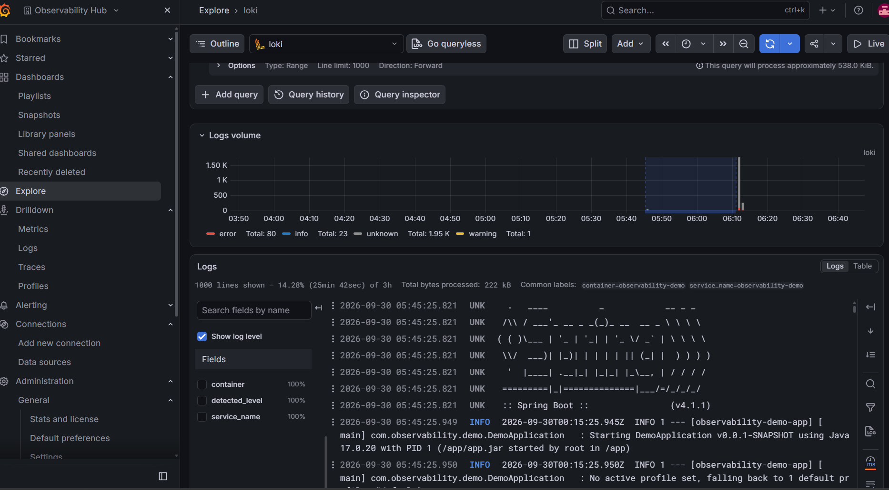

### Error Log Query with LogQL
`#loki` `#logql` `#error-logs` `#query` `#investigation`

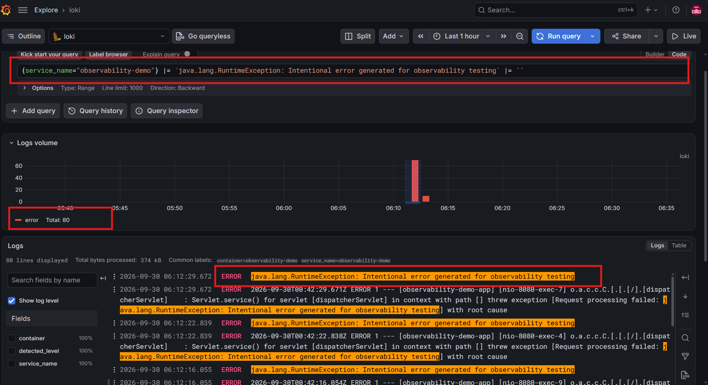

### Metrics and Logs Dashboard Correlation
`#grafana` `#dashboard` `#correlation` `#metrics-logs`

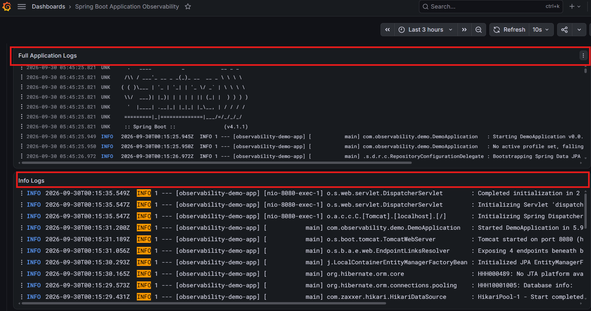

### Error Investigation Workflow
`#logs` `#troubleshooting` `#investigation` `#error-analysis`

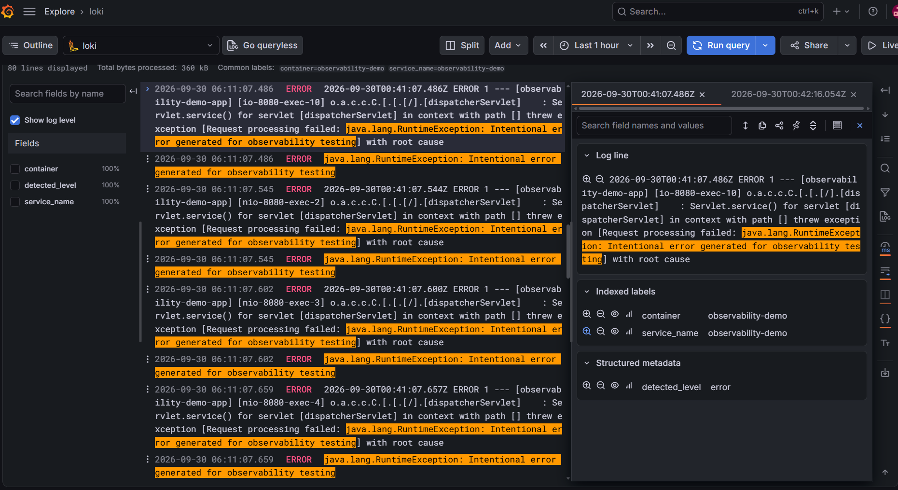

### Error & Warning Logs
`#logs` `#loki` `#errors` `#warnings` `#log-levels`

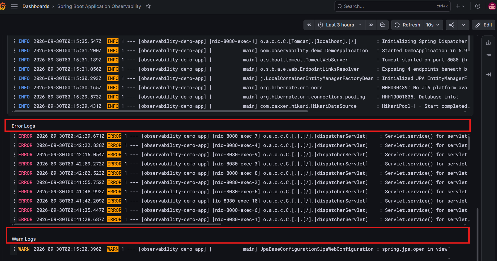
------------------------------------------------------------------------

# Phase 5 - Distributed Tracing

## OpenTelemetry + Grafana Tempo

The third major observability signal added was **tracing**.

The Spring Boot application was instrumented using the OpenTelemetry
Java Agent.

``` text
Spring Boot
     |
     v
OpenTelemetry Java Agent
     |
     | OTLP
     v
OpenTelemetry Collector
     |
     | OTLP
     v
Tempo
     |
     v
Grafana
```

Tracing makes it possible to inspect individual requests.

A trace represents the complete request, while spans represent
operations performed as part of the request.

``` text
GET /api/slow
       |
       v
      Trace
       |
       +---- Span
       +---- Span
       +---- Duration
```

Each trace contains a unique **Trace ID**.

### Key Learning

-   Distributed tracing
-   OpenTelemetry
-   OpenTelemetry Java Agent
-   OTLP
-   OpenTelemetry Collector
-   Grafana Tempo
-   Traces
-   Spans
-   Trace IDs
-   Request-level latency analysis

### Tempo Datasource Configuration
`#tempo` `#grafana` `#datasource` `#configuration` `#tracing`

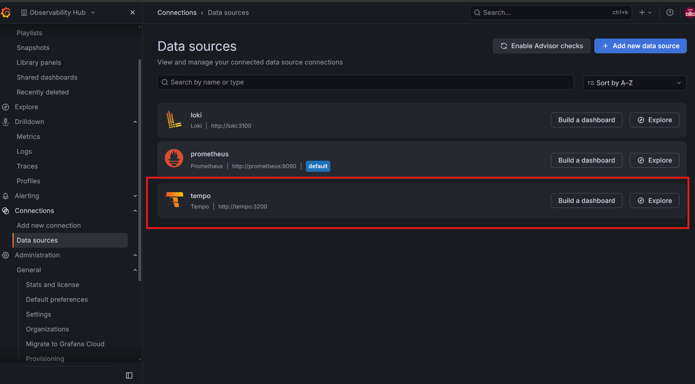

### OpenTelemetry Collector Running
`#otel` `#collector` `#traces` `#otlp` `#running`

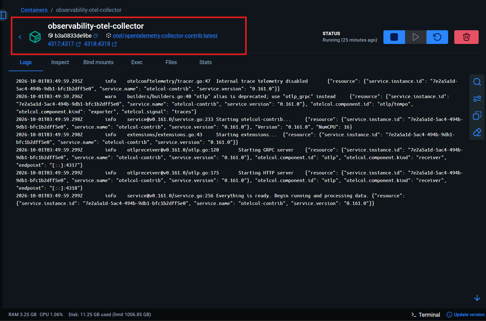

### Normal Request Trace
`#tempo` `#trace` `#normal-request` `#healthy` `#performance`

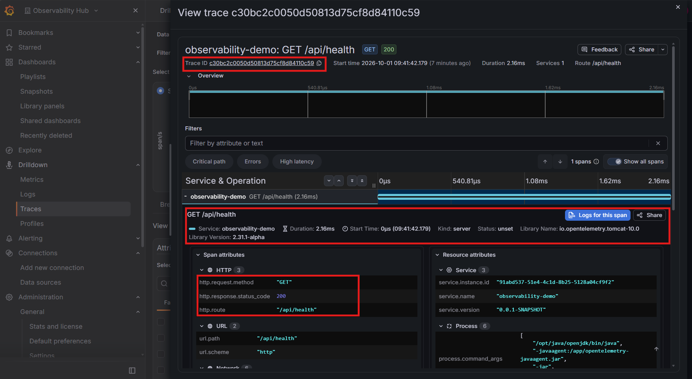

### Slow Request Trace
`#tempo` `#trace` `#slow-request` `#latency` `#investigation`

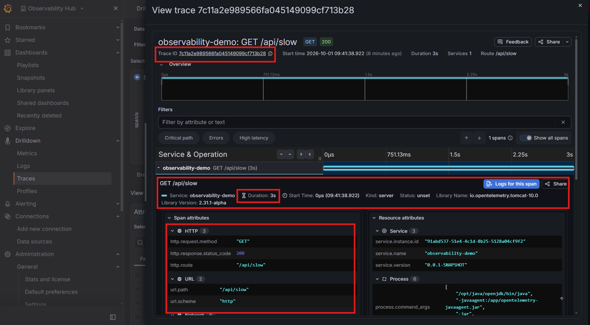

### Error Request Trace
`#tempo` `#trace` `#error-request` `#failure` `#investigation`

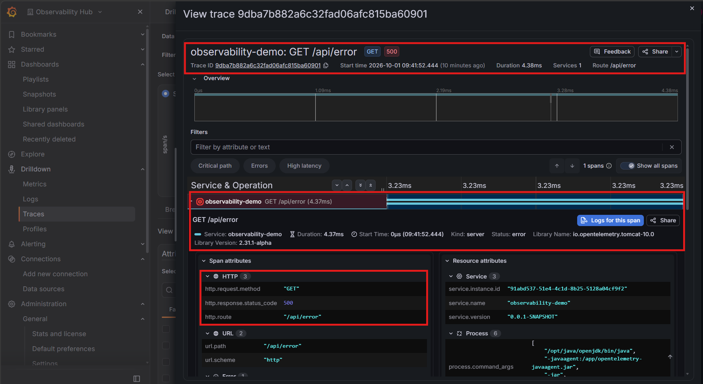

### Complete Observability Stack
`#grafana` `#dashboard` `#full-stack` `#end-to-end` `#observability`

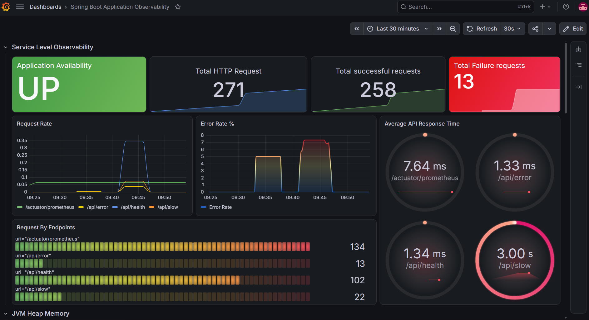


------------------------------------------------------------------------

# Phase 6 - Logs and Traces Correlation

## Loki \<-\> Tempo using Trace ID

Logs and traces were initially available as separate telemetry signals.

Phase 6 connected them using the OpenTelemetry **Trace ID**.

Example application log:

``` text
ERROR
trace_id=4bf92f3577b34da6a3ce929d0e0e4736
Application exception...
```

Tempo stores the trace using the same ID:

``` text
Trace ID:
4bf92f3577b34da6a3ce929d0e0e4736
```

Therefore:

``` text
             Trace ID
                |
        +-------+-------+
        |               |
        v               v
      Loki            Tempo
      Logs            Traces
```

## Logs -\> Traces

Grafana Loki Derived Fields extract the Trace ID from application logs.

``` text
Loki ERROR
    |
    v
Trace ID
    |
    v
View Trace
    |
    v
Tempo
```

## Traces -\> Logs

Tempo can also navigate back to related Loki logs.

``` text
Tempo Trace
     |
     v
Related Logs
     |
     v
Loki
```

The final bidirectional relationship is:

``` text
Loki Logs
    |
    | Trace ID
    v
Tempo Trace
    |
    | Related Logs
    v
Loki Logs
```

### Key Learning

-   Telemetry correlation
-   OpenTelemetry trace context
-   Trace IDs
-   Span IDs
-   Grafana Derived Fields
-   Logs-to-Traces correlation
-   Traces-to-Logs correlation
-   Cross-signal troubleshooting

### Correlation Trace Visualization
`#correlation` `#trace-id` `#logs` `#traces` `#relationship`

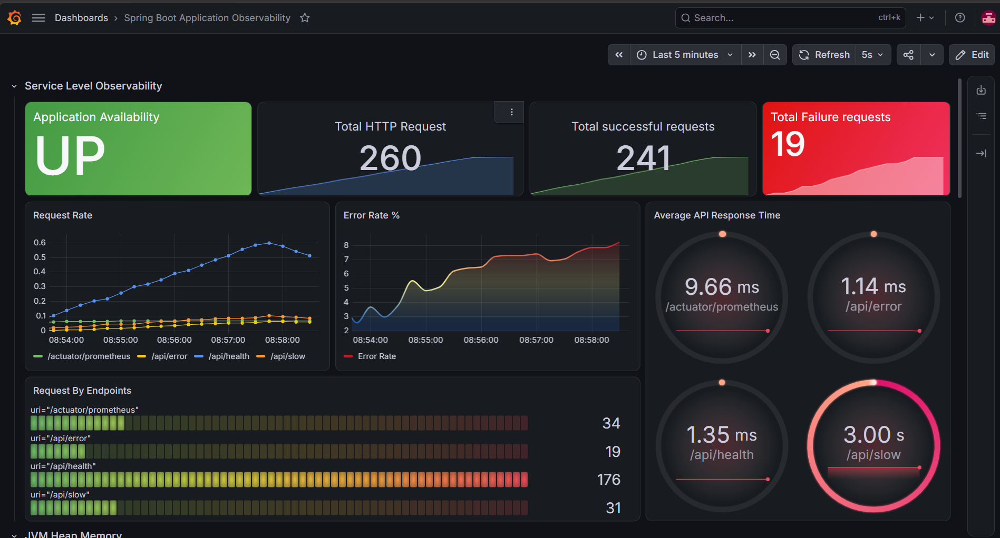

### Loki Log with Trace ID
`#loki` `#trace-id` `#logs` `#correlation` `#application-context`

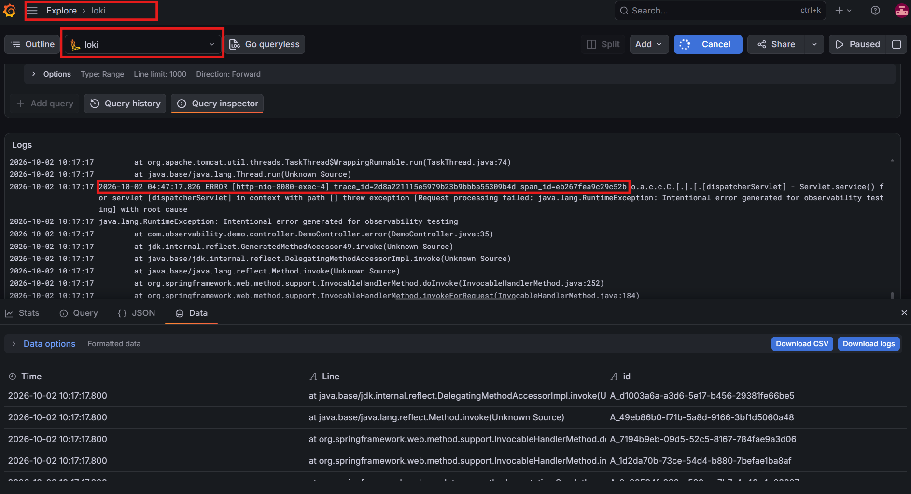

### Loki View Trace Link (Derived Fields)
`#loki` `#derived-fields` `#view-trace` `#correlation` `#linking`

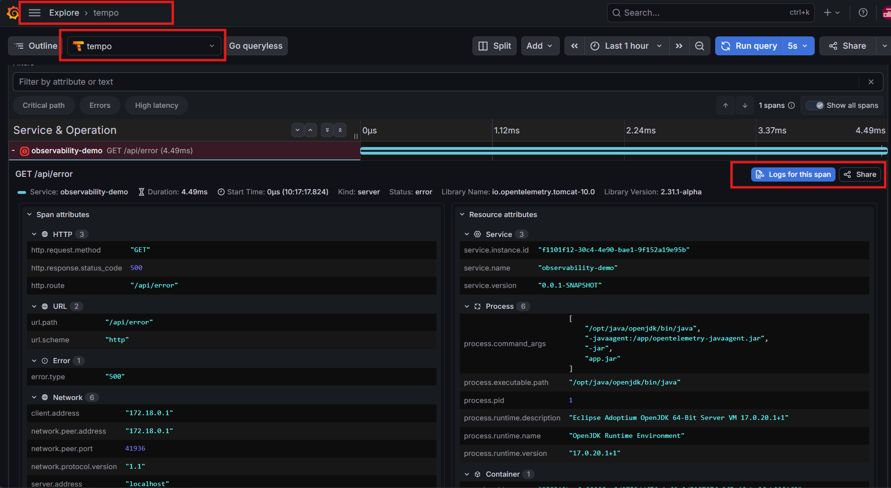

### Tempo Related Logs
`#tempo` `#related-logs` `#correlation` `#trace-to-logs` `#investigation`

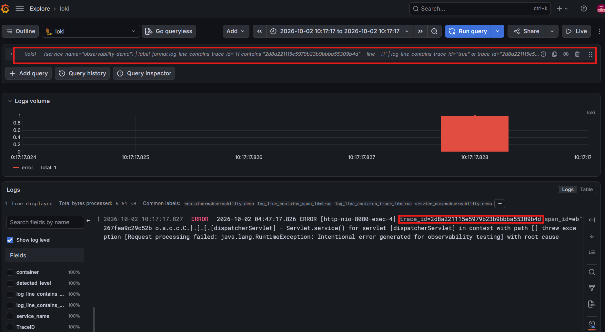

### Derived Fields Configuration
`#grafana` `#loki` `#derived-fields` `#configuration` `#trace-extraction`

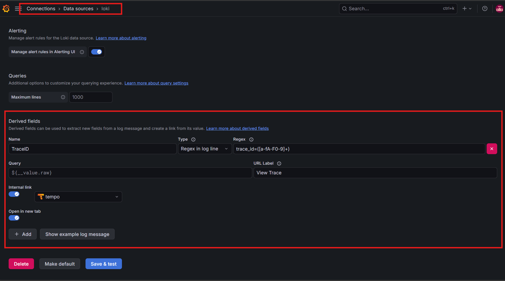


------------------------------------------------------------------------

# Phase 7 - Grafana Alerting

## Proactive Incident Detection

The final phase adds proactive problem detection.

Instead of continuously watching dashboards:

``` text
Engineer
   |
   v
Dashboard
   |
   v
Find problem manually
```

Grafana evaluates alert rules based on application metrics:

``` text
Problem
   |
   v
Prometheus Metric
   |
   v
Grafana Alert Rule
   |
   v
Alert FIRING
   |
   v
Investigation
```

Alerts can be created for conditions such as:

-   Application unavailable
-   High HTTP 5xx error rate
-   High response time
-   High JVM heap utilization

## Alert Lifecycle

``` text
NORMAL
   |
condition exceeded
   |
   v
PENDING
   |
condition remains true
   |
   v
FIRING
   |
problem resolved
   |
   v
NORMAL
```

Alerting connects the previous phases into an incident workflow:

``` text
Grafana Alert
      |
      v
Metrics
      |
      v
Grafana Dashboard
      |
      v
Loki Logs
      |
      v
Trace ID
      |
      v
Tempo Trace
      |
      v
Investigation
```

### Key Learning

-   Grafana Alerting
-   Alert rules
-   PromQL-based alert conditions
-   Thresholds
-   Evaluation intervals
-   Pending and Firing states
-   Alert labels
-   Alert annotations
-   Incident detection
-   Alert-driven investigation
-   Alert fatigue concepts

### Grafana Alert Rules Configuration
`#alerting` `#alert-rules` `#grafana` `#configuration` `#incident-detection`

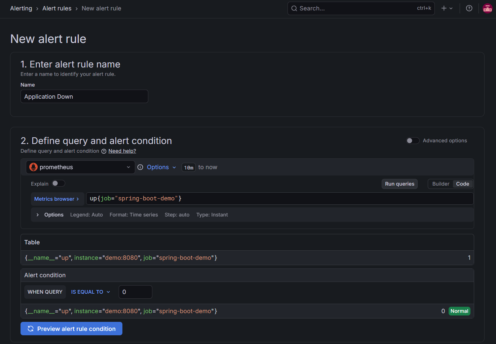


------------------------------------------------------------------------

# End-to-End Observability Workflow

After completing all seven phases, the troubleshooting workflow is:

``` text
                    PROBLEM
                       |
                       v
                Grafana Alert
                       |
                       v
                    METRICS
                       |
                       v
                  Prometheus
                       |
                       v
               Grafana Dashboard
                       |
                       v
               What is happening?
                       |
                       v
                     LOGS
                       |
                       v
                     Loki
                       |
                       v
                ERROR detected
                       |
                       v
                Trace ID found
                       |
                       v
                    TRACES
                       |
                       v
                    Tempo
                       |
                       v
              Request investigation
                       |
                       v
                 Related Logs
                       |
                       v
             Root-cause evidence
```

------------------------------------------------------------------------

# Example Incident - HTTP 500 Error

The demo application intentionally provides:

``` text
/api/error
```

to generate HTTP 500 failures.

The end-to-end flow is:

``` text
User
 |
 | GET /api/error
 v
Spring Boot
 |
 | HTTP 500
 v
Micrometer
 |
 v
Prometheus
 |
 | 5xx rate increases
 v
Grafana
 |
 | Alert fires
 v
Loki
 |
 | ERROR
 | trace_id=ABC123
 v
Tempo
 |
 | Trace ABC123
 v
Request-level investigation
```

This demonstrates how multiple telemetry signals can be used together
rather than independently.

------------------------------------------------------------------------

# Example Incident - Slow API

The endpoint:

``` text
/api/slow
```

introduces intentional latency.

Investigation:

``` text
User
 |
 | GET /api/slow
 v
Spring Boot
 |
 | ~3 second response
 v
Prometheus
 |
 | Response duration increases
 v
Grafana
 |
 | Latency detected
 v
Tempo
 |
 | Slow trace
 v
Span/request duration analysis
 |
 v
Related Loki Logs
```

------------------------------------------------------------------------

# The Three Observability Signals

## Metrics

Backend: **Prometheus**

Metrics help answer:

> What is happening?

Examples:

-   Request rate
-   Error rate
-   Latency
-   CPU
-   Memory
-   Application availability

## Logs

Backend: **Loki**

Logs provide diagnostic context.

Examples:

-   Application exceptions
-   Runtime errors
-   Database errors
-   Timeouts
-   Warnings

## Traces

Backend: **Tempo**

Traces help answer:

> Where did an individual request spend its time or fail?

Examples:

-   Request duration
-   Request path
-   Span duration
-   Failed operations
-   Trace context

------------------------------------------------------------------------

# Why Correlation Matters

Without correlation:

``` text
Metrics      Logs      Traces
   |           |          |
   +-----------+----------+
         Separate investigation
```

With correlation:

``` text
Metric anomaly
      |
      v
Logs
      |
   Trace ID
      |
      v
Trace
      |
      v
Related Logs
```

A shared Trace ID makes it easier to move between telemetry signals
while preserving request context.

------------------------------------------------------------------------

# Monitoring vs Observability

Monitoring provides known health signals such as:

``` text
CPU = 85%
5xx Rate = high
Application = DOWN
```

Observability uses multiple telemetry sources to investigate application
behavior:

``` text
Metric anomaly
      |
      v
Application logs
      |
      v
Trace
      |
      v
Request-level context
```

------------------------------------------------------------------------

# Docker Networking

All components run using Docker Compose.

Docker's internal DNS allows containers to communicate using service
names.

Examples:

``` text
Prometheus -> demo:8080
Grafana    -> prometheus:9090
Grafana    -> loki:3100
Grafana    -> tempo:3200
Collector  -> tempo:4317
```

This project also reinforces container networking and service-discovery
concepts.

------------------------------------------------------------------------

# Data Persistence

Docker volumes are used for persistent storage.

Examples:

``` text
postgres-data
prometheus-data
grafana-data
loki-data
tempo-data
```

This allows application and observability state to survive normal
container recreation.

Be careful with:

``` bash
docker compose down -v
```

because it removes Compose-managed volumes.

------------------------------------------------------------------------

# Skills Demonstrated

This project demonstrates hands-on experience with:

-   Grafana
-   Prometheus
-   PromQL
-   Grafana Loki
-   LogQL
-   Grafana Alloy
-   OpenTelemetry
-   OpenTelemetry Collector
-   Grafana Tempo
-   Micrometer
-   Spring Boot Actuator
-   Metrics
-   Logs
-   Distributed tracing
-   RED metrics
-   JVM monitoring
-   Trace IDs
-   Span IDs
-   Logs \<-\> Traces correlation
-   Grafana dashboards
-   Grafana Alerting
-   Docker
-   Docker Compose
-   Container networking
-   Incident simulation
-   Observability troubleshooting

------------------------------------------------------------------------

# Project Evolution

``` text
PHASE 1
Application
Spring Boot + PostgreSQL
       |
       v

PHASE 2
Metrics
Prometheus
       |
       v

PHASE 3
Visualization
Grafana
       |
       v

PHASE 4
Logs
Alloy + Loki
       |
       v

PHASE 5
Traces
OpenTelemetry + Tempo
       |
       v

PHASE 6
Correlation
Loki <-> Tempo
       |
       v

PHASE 7
Alerting
Grafana Alerting
       |
       v

END-TO-END
OBSERVABILITY PLATFORM
```

------------------------------------------------------------------------

# Final Learning

The biggest takeaway from this project is that observability is not only
about creating dashboards.

A useful observability platform should help answer:

``` text
Is the application healthy?
        |
        v
What changed?
        |
        v
Are users seeing errors?
        |
        v
Is latency increasing?
        |
        v
What do the logs show?
        |
        v
Which request was affected?
        |
        v
What does the trace show?
        |
        v
What evidence points toward the root cause?
```

The final workflow implemented in this lab is:

``` text
DETECT
  |
  v
ALERT
  |
  v
METRICS
  |
  v
LOGS
  |
  v
TRACE
  |
  v
INVESTIGATE
  |
  v
RECOVER
```

------------------------------------------------------------------------

# Project Status

**Completed**

``` text
Application       COMPLETE
Containerization  COMPLETE
Metrics           COMPLETE
Dashboards        COMPLETE
Logs              COMPLETE
Traces            COMPLETE
Correlation       COMPLETE
Alerting          COMPLETE
```

## End-to-End Grafana Observability Lab

Built with:

**Spring Boot \| PostgreSQL \| Docker \| Micrometer \| Prometheus \|
Grafana \| Loki \| Grafana Alloy \| OpenTelemetry \| Tempo**

------------------------------------------------------------------------

# Author

**SUMANTH PARASHURAM**  
DevOps Engineer | Cloud Engineer

**Email:** sumanthparashuram@gmail.com  
**Mobile:** +91-8431089958  
**LinkedIn:** [https://www.linkedin.com/in/sumanth-devops-engineer/](https://www.linkedin.com/in/sumanth-devops-engineer/)

------------------------------------------------------------------------

# License

Copyright © 2026 Sumanth Parashuram. All rights reserved.

This project is provided as-is for educational and demonstrative purposes.

